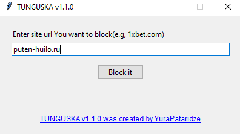
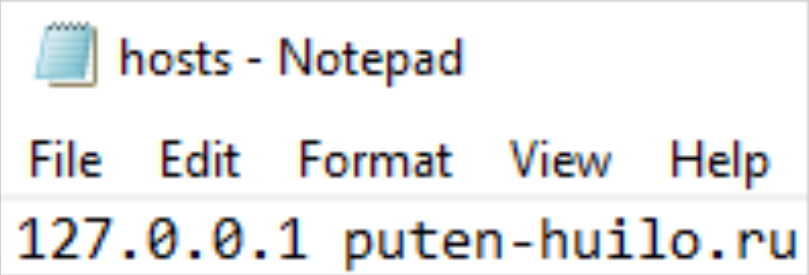

# TUNGUSKA (hosts-file blocker)

`main.py` is a small **Tkinter desktop GUI** that helps you **permanently block a site/domain** on your Windows machine by appending an entry to the system **hosts** file.

It provides a simple window where you type a domain (example: `1xbet.com`), confirm the action, and then the program adds a line like:

## What the app does

1. Shows a GUI titled **“TUNGUSKA v1.1.0”**.
2. Asks you to enter a **site URL/domain** (example shown: `1xbet.com`).
3. When you click **“Block it”**:
   - It validates the input (must not be empty/blank, must contain a dot `.`, and must not contain spaces).
   - It opens a confirmation dialog: you are asked whether you really want to permanently block the entered domain.
4. If you confirm, it appends to the Windows hosts file:
   - **`C:\Windows\System32\drivers\etc\hosts`**
   - using `open(..., 'a')` so it **adds a new line** instead of modifying an existing one.
5. After writing, it shows a success message and opens the project’s GitHub page in your browser.

## How to use

1. Download realese.
2. Type a domain you want to block (example: `1xbet.com`).
3. Click **Block it**.
4. Confirm the prompt.
5. The domain will resolve to `127.0.0.1` on your PC (effectively blocking access to it).

## Notes / limitations

- This tool **only blocks** by **adding** lines to the hosts file.
  - There is **no “unblock”** button/function in the current code.
  - To unblock, you would need to manually remove the line from the hosts file(it did on puppose cuz i created this app to use it silently).
- Because it appends to `hosts`, repeated runs may add **duplicate entries** if you block the same domain multiple times.

## Safety warning

Editing the system hosts file affects name resolution for your entire system. Use with care and only block domains you intend to block.
